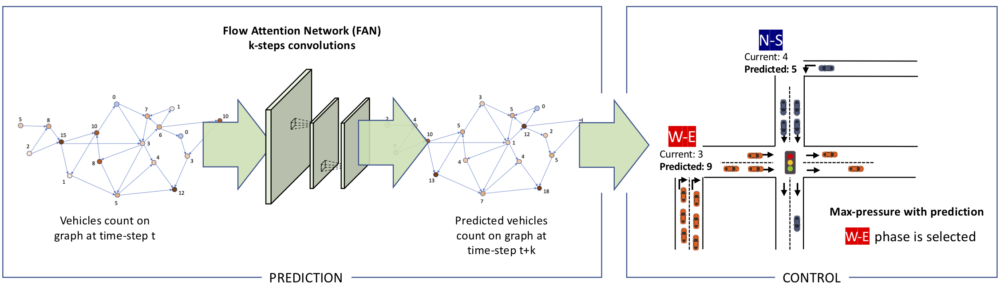

# FANPressure: Flow Attention Network for Traffic Light Optimization

In a dynamic setting, traffic light optimization can be seen as a two-steps process: anticipation of the traffic flow and phase selection to accommodate the predicted flow. Recent progress on reinforcement learning has brought promising results to traffic light optimization by implicitly (i) learning to predict future states along with their rewards, and (ii) controlling the phases to maximize the reward. At the same time, these methods require very large amount of data, either historical or simulated, and tend to overfit on the reward maximization without learning or exposing the model dynamics.
In this paper, we separate prediction and control for traffic light optimization, by combining a novel method for micro-forecasting of the flowing vehicles with the effectiveness of the Max Pressure control algorithm. We first introduce the Flow Attention Network (FAN), a micro-forecasting deep learning model as a special case of a graph attention network. The FAN uses the actual road network connections as input graph, and the message passing paradigm as a way of predicting the flow of the vehicles in the network. In the input graph, each road segment of road network is represented as a node and each connection between segments as an edge. The number of vehicles in each movement is predicted based on latent features of source and destination road segments, learned as node embeddings during the training.
The proposed method is evaluated on a real road network traffic, reproduced on the SUMO micro-simulator, showing significant improvement in avoiding congestion, increasing throughput and reducing CO2 emissions. 

